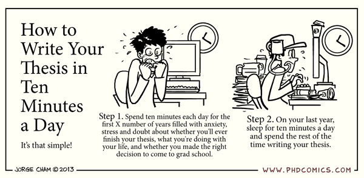

Here is a simple way to insert an amusing image:



Here is my prefered way to insert an image, giving me more control over the caption and size (Figure \@ref(fig:cartoon)):

```{r cartoon, fig.cap="A silly cartoon", echo = FALSE}

```

