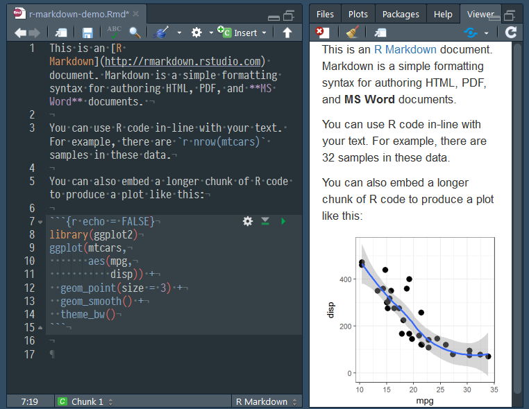
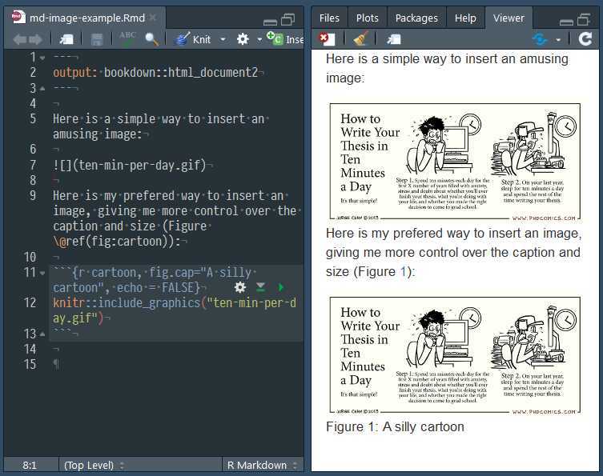
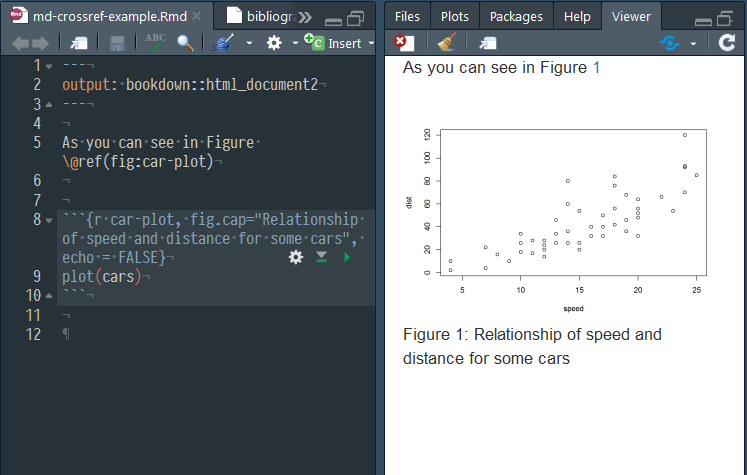
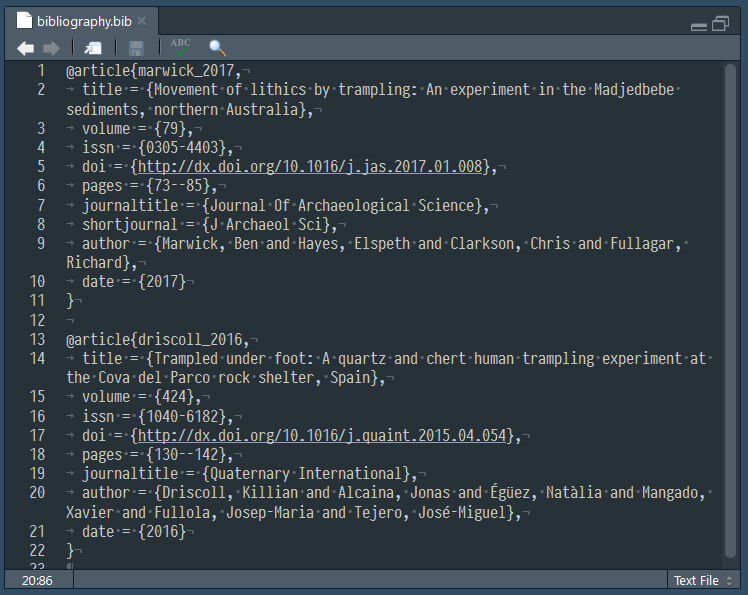
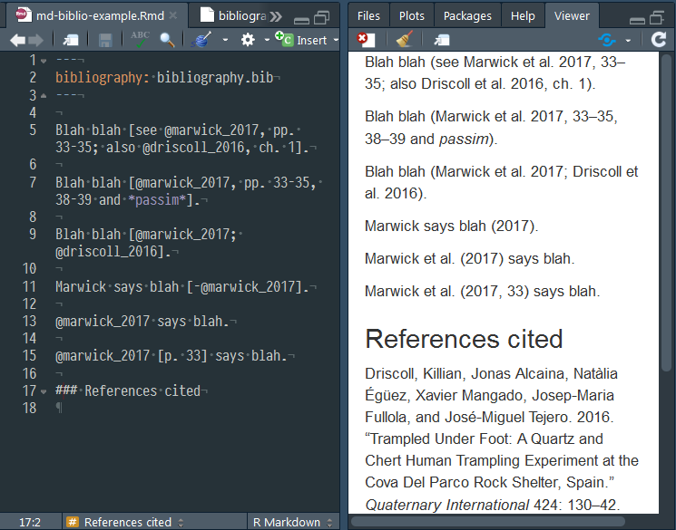
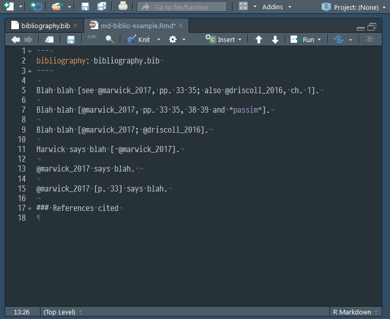
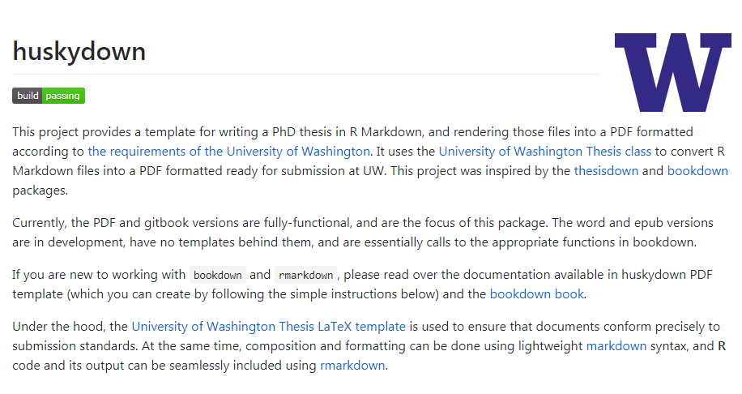

```{r setup, include=FALSE}
options(htmltools.dir.version = FALSE)
htmltools::tagList(rmarkdown::html_dependency_font_awesome())
```


class: normal, center

# Motivation


---
class: normal, center


---
class: normal

# How can R & Markdown help with common problems of dissertation writing?

.large[<i class="fa fa-frown-o"></i> Getting & staying organised]     
.large[<i class="fa fa-frown-o"></i> Citation & cross-referencing management]       
.large[<i class="fa fa-frown-o"></i> Formatting multi-part documents]   
.large[<i class="fa fa-frown-o"></i> Backing up files]    


---

class: normal

# Why write in Markdown?

.large[<i class="fa fa-edit"></i> Simple text formatting system]     
.large[<i class="fa fa-edit"></i> 80% can be learned in 5 mins]     
.large[<i class="fa fa-edit"></i> Extensible via LaTeX]     
.large[<i class="fa fa-edit"></i> Plain text, cross-platform, flexible outputs]     

---
class: normal, center


---
class: normal, center


---
class: normal, center




---
class: normal

# Getting & staying organised with Markdown & R

.large[<i class="fa fa-lightbulb-o"></i> One chapter = one md file]      
.large[<i class="fa fa-lightbulb-o"></i> Images by reference only]      
.large[<i class="fa fa-lightbulb-o"></i> Figure and table citation and cross-referencing is abstracted]   

---
class: normal, center



---
class: normal, center



---

class: normal

# Easy citations & bibliographies with Markdown & R

.large[<i class="fa fa-book"></i> Uses Bibtex system]      
.large[<i class="fa fa-book"></i> Get bib format entries from Google Scholar & Zotero et al. ]      
.large[<i class="fa fa-book"></i> Very large variety of styles possible]   

---
class: normal, center



---
class: normal, center



---
class: normal, center



---

class: normal

# Multipart documents made easy

.large[<i class="fa fa-thumbs-up"></i> [Bookdown](https://bookdown.org/yihui/bookdown/) pkg for R]      
.large[<i class="fa fa-thumbs-up"></i> Write in many Rmd files & combine into one book]      
.large[<i class="fa fa-thumbs-up"></i> Apply complex styles & templates]  


---
class: normal, center


https://github.com/benmarwick/huskydown
---

class: normal, center


---

class: normal, center


Kieran Healy's "The Plain Person’s Guide to Plain Text Social Science" , http://plain-text.co

---
class: normal

# Backing up files & and sharing with others

.large[<i class="fa fa-github"></i> Git is a version control and collaboration system ]     
.large[<i class="fa fa-github"></i> R & Markdown work well with Git]      
.large[<i class="fa fa-github"></i> GitHub and many others offer free private storage for Git repositories]    

---

class: normal, center


It can be hard to go from simple examples to the real thing we actually want.

---
class: normal, center

# R & Markdown are an easy way to make research more reproducible & transparent


---
class: normal

# To conclude

.large[<i class="fa fa-check-square-o"></i> In huskydown we have encoded many best practices in getting organised & backing up]   

.large[<i class="fa fa-clock-o"></i> Plain text systems are more robust & flexible] 

.large[<i class="fa fa-recycle"></i> We have a sustainable path to working reproducibly]

---
class: normal

background-image: url(https://media.giphy.com/media/aO2xSELarYXfy/giphy.gif)


---

class: normal

# Colophon

.larger[
Presentation written in [R Markdown using xaringan](https://github.com/yihui/xaringan)

Compiled into HTML5 using [RStudio](http://www.rstudio.com/ide/) & [knitr](http://yihui.name/knitr)

Source code hosting:
https://github.com/benmarwick/

ORCID: http://orcid.org/0000-0001-7879-4531

Licensing: 

* Presentation: [CC-BY-3.0](http://creativecommons.org/licenses/by/3.0/us/)

* Source code: [MIT](http://opensource.org/licenses/MIT) ]


